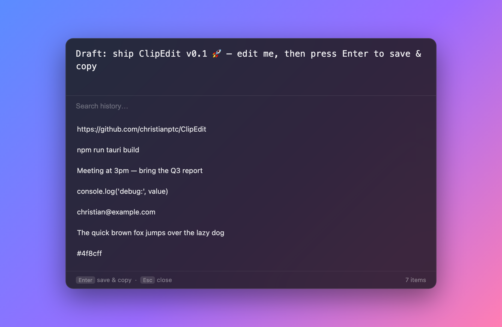
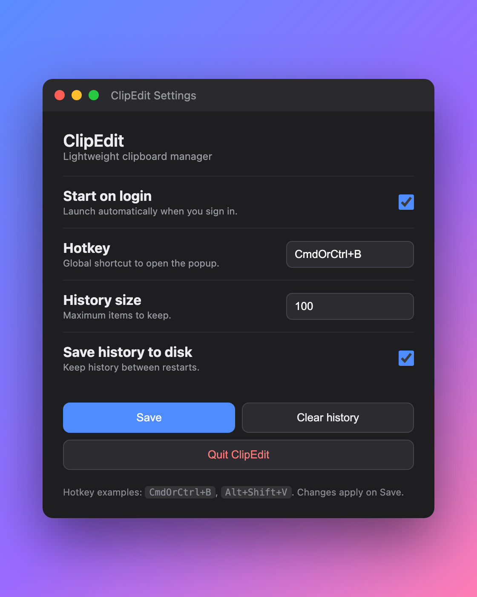

<p align="center">
  
</p>

<h1 align="center">ClipEdit</h1>

<p align="center">
  A tiny, fast clipboard manager for <b>macOS</b> and <b>Windows</b>.<br/>
  Press a hotkey, get a Spotlight-style popup with your <b>editable</b> clipboard and full history.
</p>

<p align="center">
  
</p>

---

## Why

Windows has `Win + V`, macOS has nothing built in, and neither lets you **edit** the
current clipboard before you paste. ClipEdit does both, from one tiny background app that
lives in your menu bar / system tray and stays out of your way.

- ⚡️ **Featherweight** — a ~3 MB app. No Electron, no bundled browser. The window's webview
  isn't even created until you open the popup, so it costs next to nothing while idle.
- ⌨️ **One hotkey** — `Cmd + B` (macOS) / `Ctrl + B` (Windows) opens the popup anywhere.
- ✏️ **Editable clipboard** — the current clipboard sits at the top, ready to edit. Press
  **Enter** and the edited text is copied *and* both the old and new versions are saved to history.
- 🕘 **Automatic history** — everything you copy, anywhere, is captured and searchable.
- 🔒 **Privacy-aware** — entries marked sensitive by password managers (concealed/transient
  clipboard) are skipped, history is stored only in your user profile, and you can wipe or
  disable it anytime.
- 🖥️ **Cross-platform, one codebase** — menu-bar accessory on macOS (no Dock icon), system-tray
  app on Windows.

## How to use

| Action | What happens |
| --- | --- |
| `Cmd/Ctrl + B` | Open / close the popup (centered, always on top). |
| Type in the top box, **Enter** | Saves the previous clipboard **and** your edited text to history, copies the edit. |
| Click a history row | Copies that entry and closes. |
| Type in **Search history…** | Filters the list instantly. |
| `Esc` or click away | Closes the popup. |
| `×` on a row | Removes that entry from history. |
| Tray / menu-bar icon | Left-click opens the popup; right-click for the menu (Settings, Start on login, Clear history, Quit). |

## Install

### Option A — Download (recommended)

Grab the installer for your platform from the
[**Releases**](https://github.com/christianptc/ClipEdit/releases) page:

- **macOS** — open the `.dmg` and drag **ClipEdit** to Applications.
- **Windows** — run the `.exe` / `.msi` installer.

> These builds are unsigned, so the first launch shows a warning. On macOS, right-click the app →
> **Open**. On Windows, click **More info → Run anyway**.

### Option B — Build from source

**Prerequisites:** [Rust](https://rustup.rs) and [Node.js](https://nodejs.org) 18+
(macOS also needs Xcode Command Line Tools; Windows needs the MSVC C++ Build Tools — WebView2 ships with Windows 10/11).

```bash
git clone https://github.com/christianptc/ClipEdit.git
cd ClipEdit
npm install
npm run tauri build      # installer in src-tauri/target/release/bundle/
# or run it live during development:
npm run tauri dev
```

## Settings

Open **Settings** from the tray / menu-bar icon. First launch shows it automatically.

<p align="center">
  
</p>

- **Start on login** — launch ClipEdit automatically (registry Run key on Windows, Launch Agent on macOS).
- **Hotkey** — any combo, e.g. `CmdOrCtrl+B`, `Alt+Shift+V`.
- **History size** — how many entries to keep (default 100).
- **Save history to disk** — turn off for memory-only history that vanishes on quit.

## Privacy

- History is kept only under your user profile (macOS `~/Library/Application Support/`,
  Windows `%APPDATA%`).
- Clipboard entries flagged **concealed / transient** (the convention password managers use)
  are never recorded.
- **Clear history** and **Save history to disk** toggles are in Settings.

## How it works

Built with [Tauri 2](https://v2.tauri.app): a small Rust core renders the UI in the OS's
native webview, so binaries are tiny and idle resource use is minimal. A background thread
watches the clipboard via OS-native change notifications and records new text into a bounded,
de-duplicated history that's persisted as JSON with atomic writes. The UI is plain
HTML/CSS/JS — no framework runtime.

## Tech stack

Tauri 2 · Rust · `tauri-plugin-global-shortcut` · `tauri-plugin-autostart` · `arboard` ·
`clipboard-master` · vanilla HTML/CSS/JS.

## License

[MIT](LICENSE)
